# CFD Projects Portfolio

**Author:** Amol Satdive  
M.Tech – IITD  

This repository contains selected computational fluid dynamics (CFD) related work.

---

# Project 1: Spectral Decomposition of Developed Turbulent Pipe Flows

**Supervisor:** Prof. Ritabrata Thakur  
**Note:** Detailed solver modifications and additional importanant quantitative results cannot be shared at this stage as the work is unpublished.

---

## Overview

The project investigates turbulence control mechanisms (enhancement and suppression) in pipe flow using various boundary forcings for optimizing mixing and transport efficiency.

A localized turbulent puff at Re = 1900 is evolved to Re = 5300 and simulated for 800 non-dimensional time units.

---

## Numerical Configuration

- Reynolds number: **Re = 5300**
- Pipe radius: **R = 1**
- Pipe length: **L = 15R**
- Rotation numbers studied: **N = 0** and **N = 4**

---

## Solver

Simulations performed using **openpipeflow**:

- Spectral discretization (axial & azimuthal)
- High-order finite differences (radial)
- Written in Fortran 90
- MPI-parallelized (HPC ready)

To simulate rotation of the pipe, two approaches were considered.  
Using an inertial frame requires prescribing azimuthal velocity \( u_\theta \) at \( R = 1 \), which can be numerically stiff.  

Instead, a rotating frame formulation was adopted by adding Coriolis forces:

```
F_theta = -2 * Omega * u_r
F_r     =  2 * Omega * u_theta
```

This significantly improves numerical stability and convergence.

---

## Flow Field Snapshots

### Initial Condition (Localized Puff, Re = 1900)
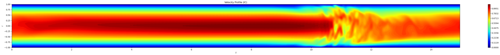

---

### Non-Rotating Case (N = 0)
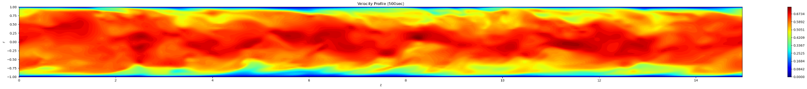

---

### Rotating Case (N = 4)
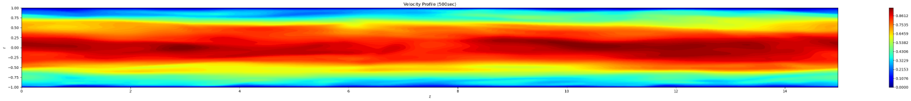

---

## Key Result

- Turbulence randomness observed at **N = 0** reduces significantly at **N = 4**
- At Re = 5300 and N = 4:
  ➝ Achieved **14% drag reduction**

---

# Project 2: 2D Lid-Driven Cavity Flow (SIMPLE Algorithm)

**Type:** Self-Developed CFD Solver  
**Language:** Python  
**Method:** Finite Volume Method (FVM)  
**Algorithm:** SIMPLE  

---

## Overview

Developed a 2D incompressible Navier–Stokes solver for the classical lid-driven cavity problem using the SIMPLE algorithm.

The solver includes:

- Momentum discretization using FVM
- Pressure correction equation
- Under-relaxation for stability
- Face velocity correction
- Residual monitoring and convergence tracking
- Post-processing (vorticity, divergence, streamlines)

---

## Numerical Setup

- Reynolds Number: **Re = 100**
- Grid size: **30 × 30**
- Domain: Unit square
- Lid velocity: **u = 1**
- No-slip walls on other boundaries
- Convergence based on L2 residual norms

---

## Results

### Velocity Magnitude + Streamlines
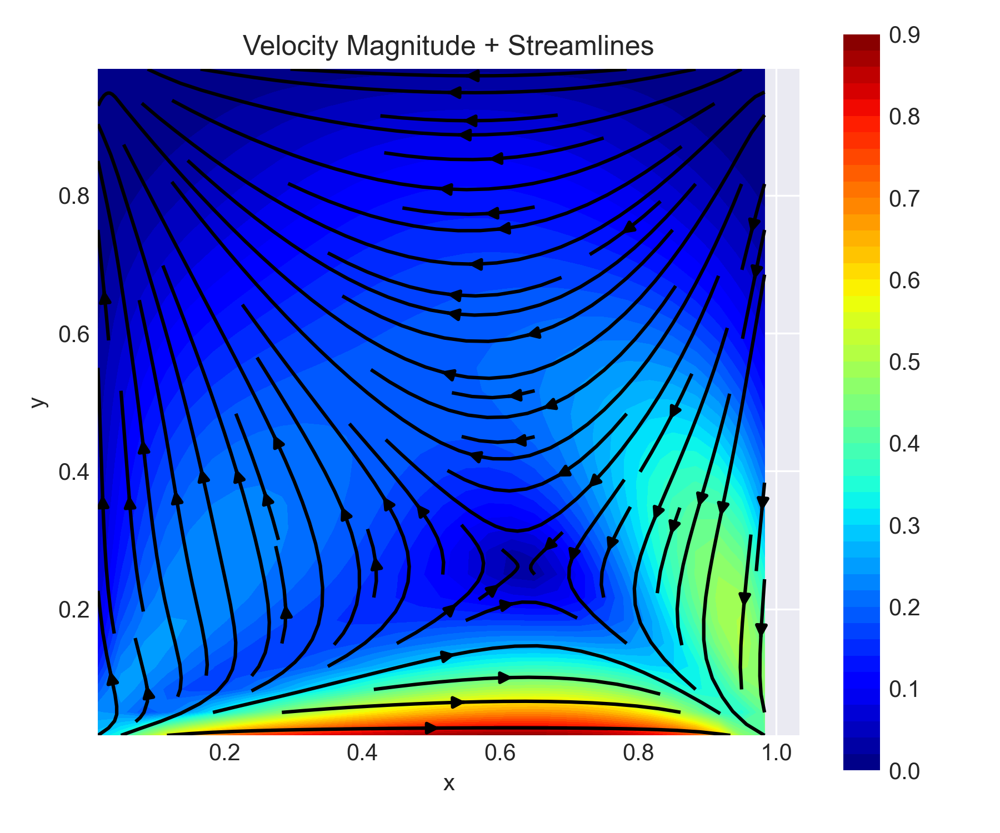

---

### Pressure Contours
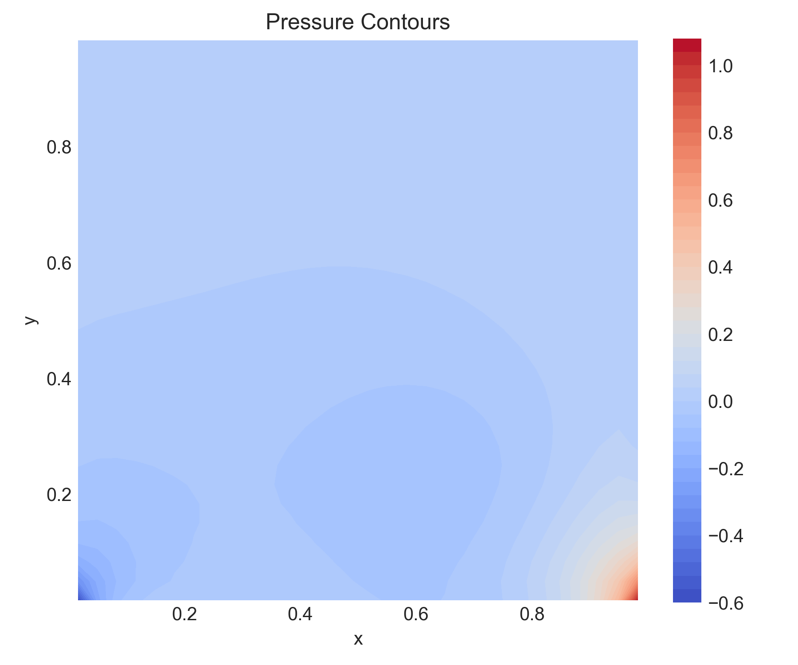

---

### Residual Convergence History
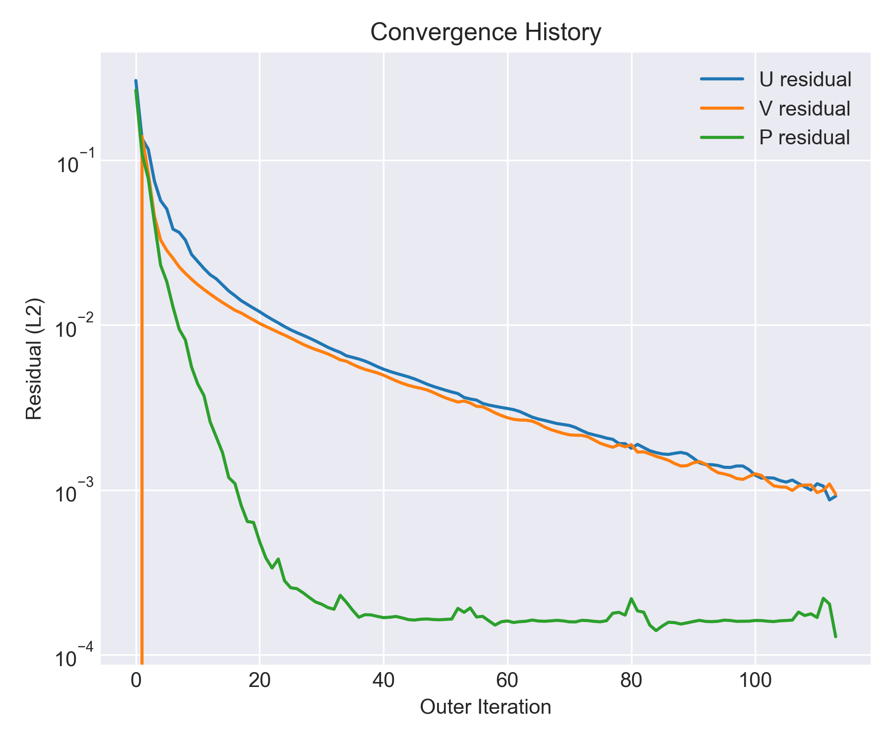

---

## Key Observations

- Formation of primary vortex at cavity center
- Secondary corner vortices captured at Re = 100
- Divergence ≈ 10⁻⁶ confirming mass conservation
- Stable convergence using under-relaxation (α_uv = 0.7, α_p = 0.2)

---

---

# Project 3: Heat Transfer in Wavy Channel

**Software:** ANSYS Fluent  
**Flow Type:** Internal Flow with Heat Transfer  

---

## Overview

This project investigates heat transfer and velocity development in a **wavy channel geometry**.  
The wavy structure induces secondary flows that enhance mixing and heat transfer compared to a straight channel.

---

## Numerical Setup

- Solver: **Pressure-based, Steady**
- Flow regime: **Laminar**
- Working Fluid: **Water (liquid)**
- Energy equation: **Enabled**

### Boundary Conditions

- Inlet velocity: **0.011 m/s**
- Inlet temperature: **293.15 K**
- Outlet: **Atmospheric pressure**
- Walls: **No-slip condition**

### Numerical Scheme

- Pressure–velocity coupling: **SIMPLE**

---

## Results

### Temperature Distribution
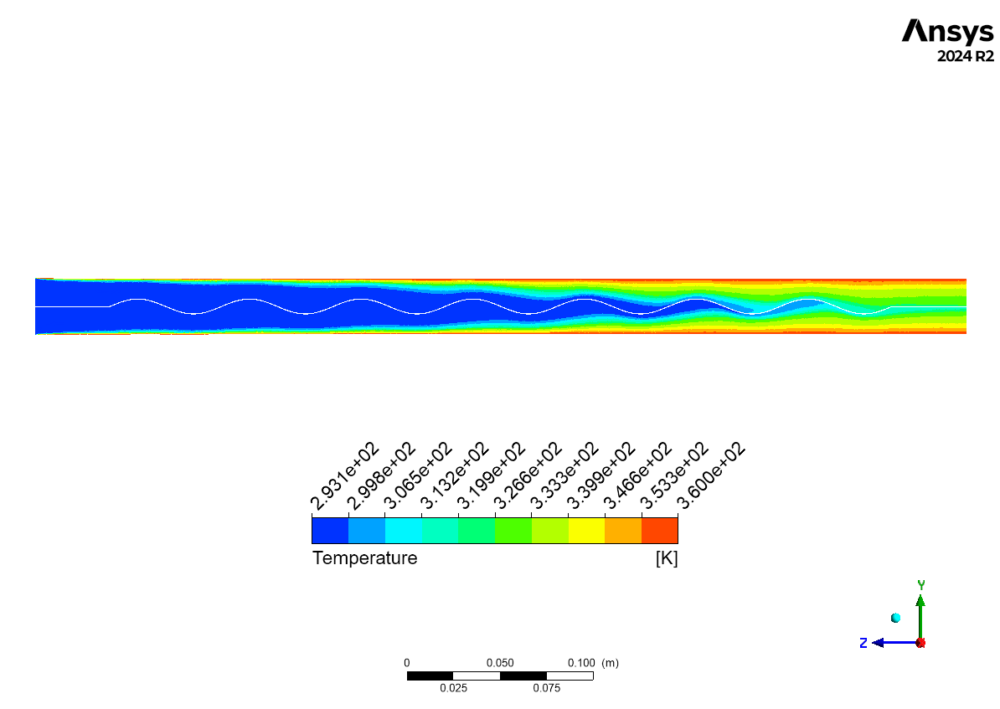

---

### Velocity Contours
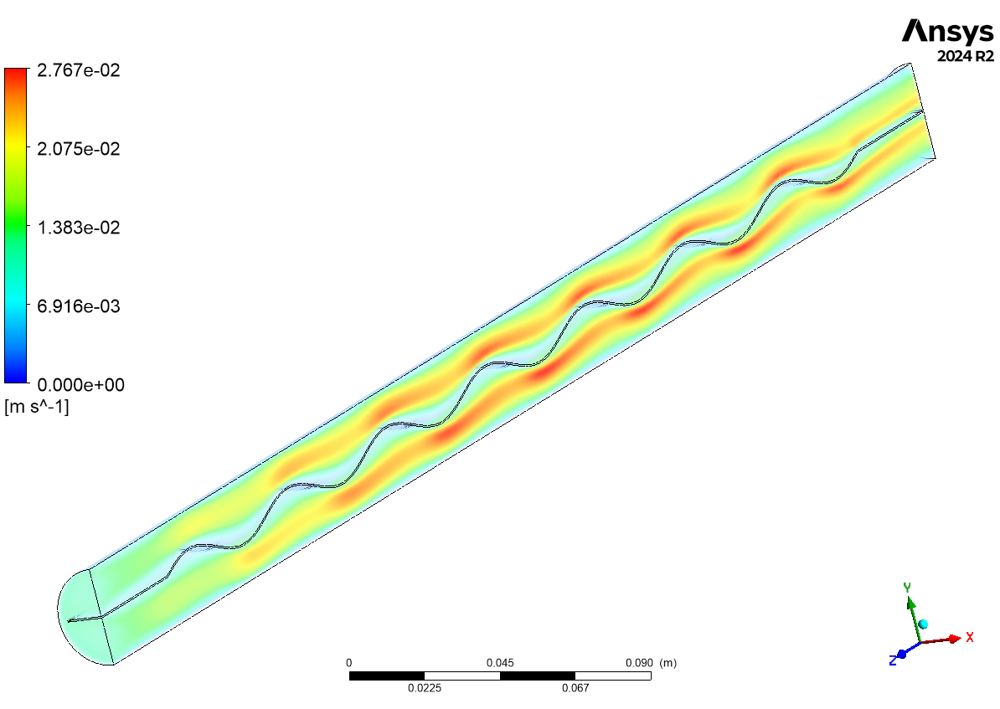

---

### Velocity Streamlines
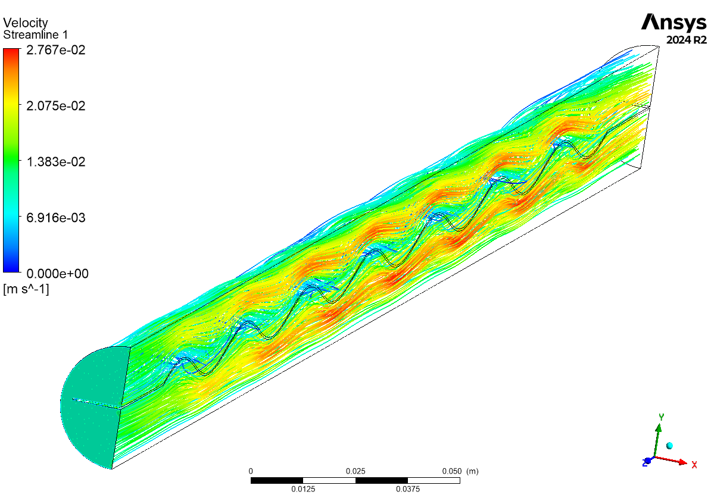

---

## Key Observation

- Wavy geometry generates **secondary circulation patterns**
- Enhanced **thermal mixing**
- Improved **heat transfer characteristics**

---

# Project 4: Thermal Analysis of Exhaust Manifold

**Software:** ANSYS Fluent  

---

## Overview

This simulation investigates **flow distribution and heat transfer in an exhaust manifold**.  
The objective is to analyze **temperature distribution and flow mixing** inside the manifold.

---

## Numerical Setup

- Solver: **Pressure-based, Steady**
- Energy equation: **Enabled**
- Turbulence model: **k–ω SST**
- Working fluid: **Air**

### Solid Material (Manifold)

Material: **Cast Iron**

Properties used:

- Density: **7150 kg/m³**
- Specific Heat: **460 J/kg·K**
- Thermal Conductivity: **50 W/(m·K)**

---

## Boundary Conditions

- Inlet velocity: **10 m/s**
- Inlet temperature: **925 K**
- Outlet: **Atmospheric pressure**

Wall thermal condition:

- Convective heat transfer
- Heat transfer coefficient: **10 W/m²K**
- Ambient temperature: **300 K**

---

## Numerical Scheme

- Pressure–velocity coupling: **Coupled scheme**

---

## Results

### Manifold Geometry
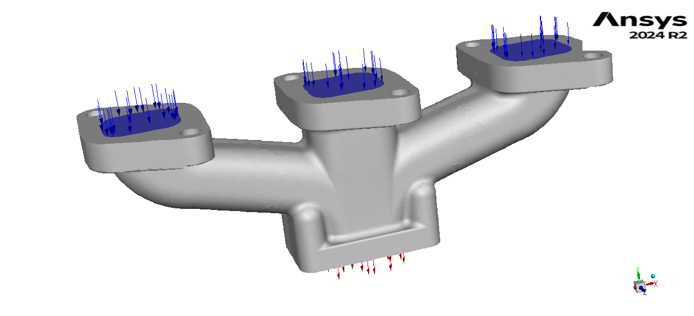

---

### Flow Pathlines
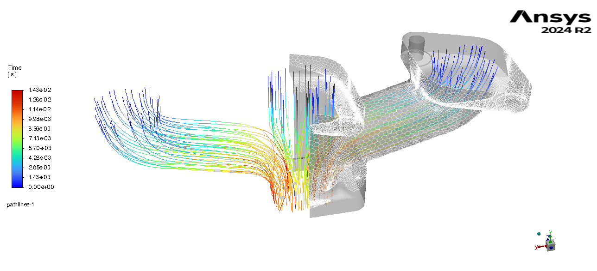

---

### Temperature Distribution
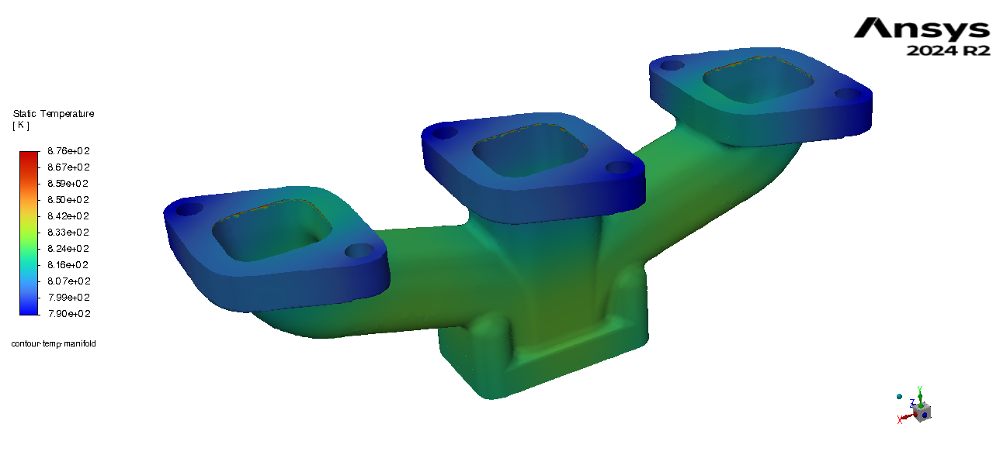

---

## Key Observation

- Flow mixing occurs inside the collector section
- Temperature gradients observed along the manifold branches
- Heat loss occurs due to external convection

---

# Project 5: Convective Heat Transfer in Heated Pipe

**Software:** ANSYS Fluent  

---

## Overview

This simulation investigates **forced convection heat transfer in a circular pipe** with constant wall heat flux.  
The **Nusselt number variation along the pipe length** is analyzed to study thermal boundary layer development.

---

## Geometry

- Pipe radius: **0.03 m**
- Pipe length: **2 m**

---

## Numerical Setup

- Solver: **Pressure-based, Steady**
- Energy equation: **Enabled**
- Turbulence model: **Standard k–ε**
- Wall treatment: **Standard Wall Function**
- Working fluid: **Water (liquid)**

---

## Boundary Conditions

- Inlet velocity: **0.4 m/s**
- Inlet temperature: **298.15 K**
- Outlet: **Atmospheric pressure**
- Wall condition: **Constant heat flux = 5000 W/m²**

---

## Numerical Scheme

- Pressure–velocity coupling: **SIMPLE**

---

## Results

### Pipe Geometry
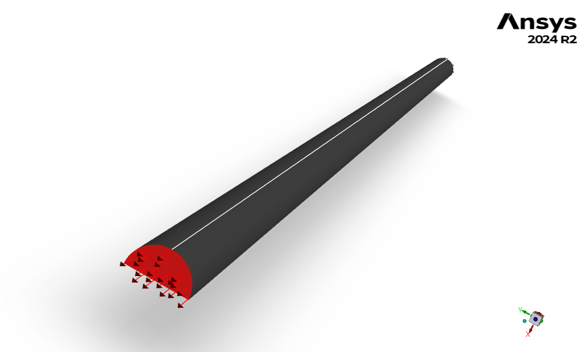

---

### Velocity Profile
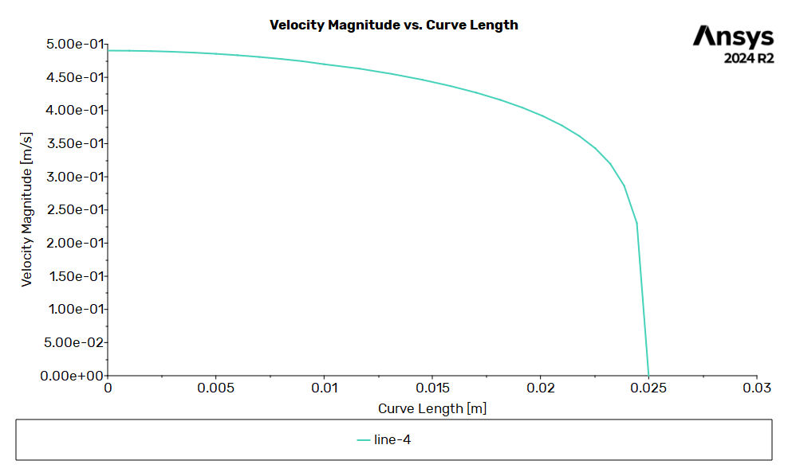

---

### Nusselt Number Variation
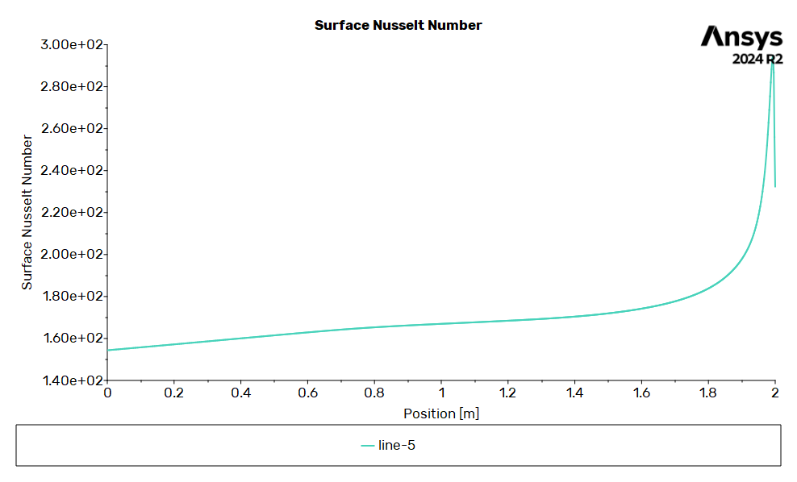

---

## Key Observation

- Thermal boundary layer grows along the pipe length.
- Local **Nusselt number increases downstream** due to thermal development.

---

# Project 6: Aerodynamic Analysis of NACA 0015 Airfoil

**Software:** ANSYS Fluent  

---

## Overview

This project evaluates the aerodynamic performance of a **NACA 0015 airfoil** by analyzing pressure distribution and velocity contours.

The **pressure coefficient distribution** along the airfoil surface is extracted to understand lift characteristics.

---

## Numerical Setup

- Solver: **Pressure-based, Steady**
- Energy equation: **Disabled**
- Turbulence model: **k–ω SST**
- Working fluid: **Air**

---

## Boundary Conditions

- Inlet velocity: **17 m/s**
- Outlet: **Atmospheric pressure**
- Airfoil surface: **No-slip wall**

---

## Numerical Scheme

- Pressure–velocity coupling: **SIMPLE**

---

## Results

### Pressure Contours
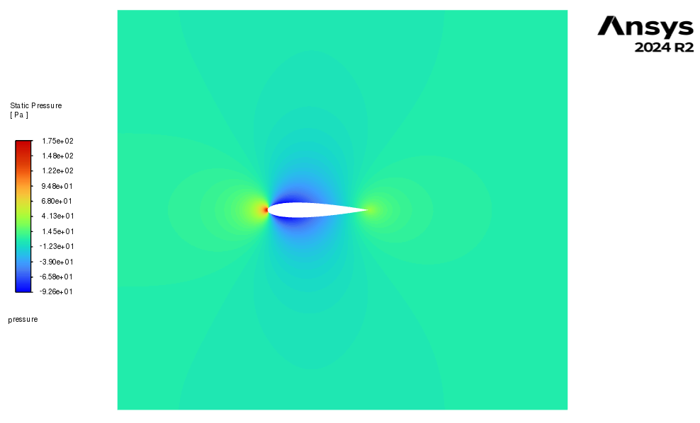

---

### Velocity Contours
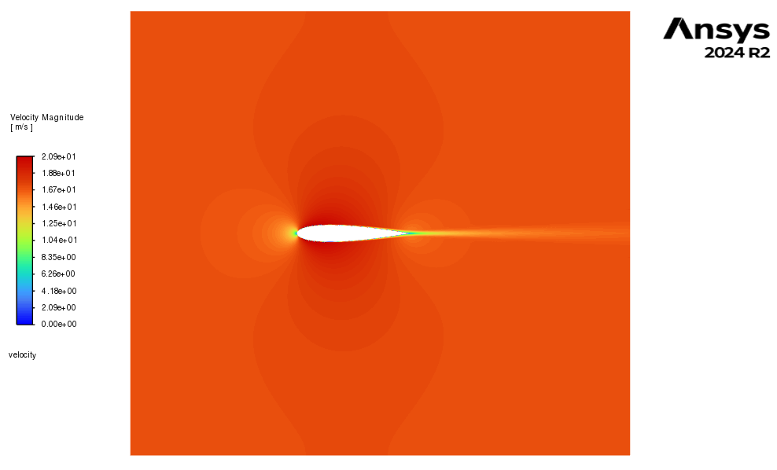

---

### Pressure Coefficient Distribution
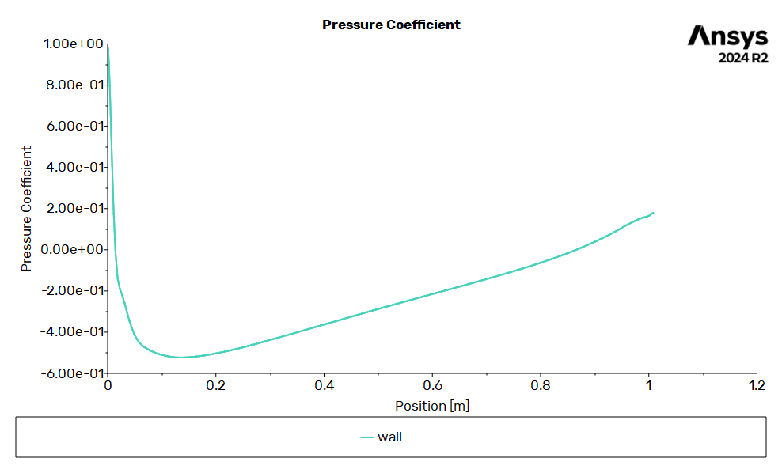

---

## Key Observation

- High pressure region at the **leading edge stagnation point**
- Pressure drop over the airfoil surface
- Cp variation consistent with aerodynamic theory

---


## Tech Stack

- ANSYS Fluent 2024 R2
- Fortran 90  
- MPI  
- Python (NumPy, SciPy, Matplotlib)  
- HPC Execution  
